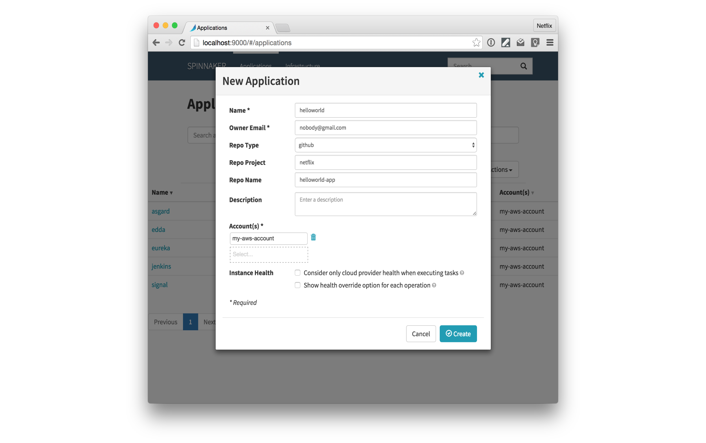
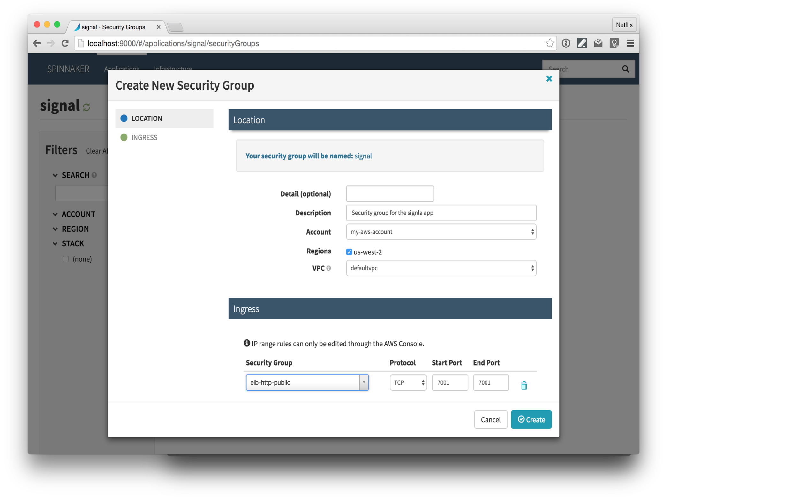
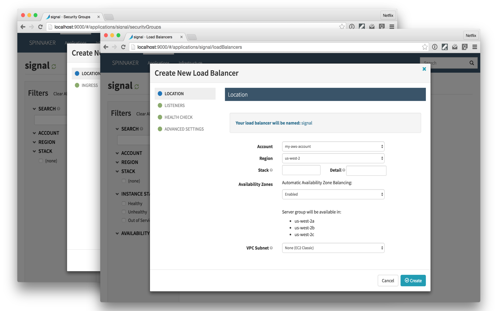
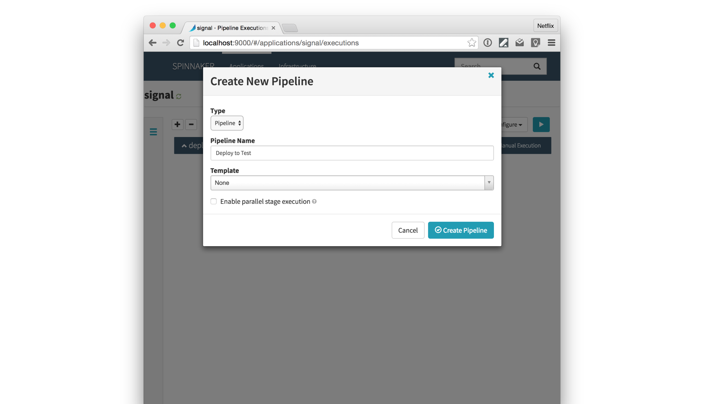
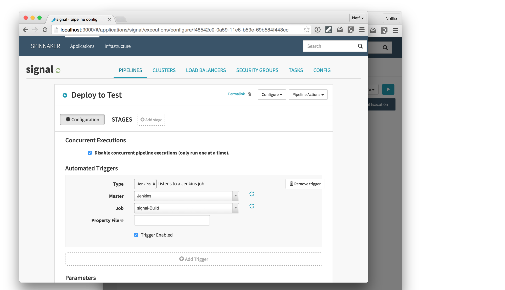

---

^ Netflix is global internet TV service
available in over 190 countries
localized to over 20 languages

---

---
Netflix streaming service started in 2007

---
started with a datacenter

^
we weren't good at building datacenters

---
Migrate to the cloud

---

^ - As we migrated to the cloud, we learned a lot of lessons

---

^ - we learned a lot of lessons
- these lessons have been codified in our OSS
- we began open sourcing in _____

---

^ - 128 repos in Netflix org

---
# [fit] _Build_ and _deploy_ to the cloud using

### Mike McGarr   _*[@SonOfGarr](http://twitter.com/SonOfGarr)*_   _*[MikeMcGarr.com](http://www.mikemcgarr.com)*_

^ I will start with an example

---
- create an installable Java microservice
- install and bake a microservice
- define our AWS deployment
- create a deployment pipeline

---

---
- create an installable Java microservice
- *install and bake a microservice*
- *define our AWS deployment*
- *construct a deployment pipeline*

---
# A simple microservice

- Groovy
- Spring Boot

---

---

---

---

let's run a build

---

*Gradle's Application Plugin*
gives us a runnable app

---

^ - go back to our pipeline
- need to convert code to Debian

---
Immutable server pattern

^ - never change code running on an instance
- prevent configuration drift
- easily scale up and scale down

---

^ should I remove this slide?

---

## Nebula Plugins

dependency lock *plugin*
resolution rules *plugin*
dependency recommender *plugin*
lint *plugin*
metrics *plugin*
test *plugin*
publishing *plugin*
ospackage *plugin*

---

1. Add the *Nebula ospackage* plugin (blue)
2. Define the *Debian* package content (red)

---

---

let's build a *Debian* package

---

*Nebula's* ospackage plugin
produces a *Debian* package

---
- *create an installable Java microservice*
- install and bake a microservice
- *define our AWS deployment*
- *construct a deployment pipeline*

---
unit of deployment

---
# Baking

---

---

Aminator

---

---
`sudo aminate /
-e ec2_aptitude_linux /
-b ubuntu-base-ami-ebs /
helloworld_1.0.0_all.deb`

^ -e environment
-b base ami image

---

---

---
- *create an installable Java microservice*
- *install and bake a microservice*
- define our AWS deployment
- *construct a deployment pipeline*

---

---
AWS - create instances

---
# minimal instance needs
- security groups
- launch configurations
- elastic load balancers
- Amazon Machine Image

---
auto-scaling groups

---

---
# Spinnaker

- Cloud deployment & pipelines
- microservice architecture
- Java & Groovy Spring Boot microservices

---

---

---

---

---
- *create an installable Java microservice*
- *install and bake a microservice*
- *define our AWS deployment*
- construct a deployment pipeline

---
Continuous delivery

---

---

### Spinnaker community AMI

---

### Bastion, Jenkins & Spinnaker

---

## Jenkins build job
- checkout from Github
- `./gradlew clean build buildDeb`
- publish debian package

---

---

---

---

---

---

---

---

---
What's next?

---
- Eureka *(service discovery)*
- Edda *(track cloud changes)*
- Chaos Monkey *(kill prod instances)*

---
# Questions?
### Mike McGarr
### _*[@SonOfGarr](http://twitter.com/SonOfGarr)*_
### _*[MikeMcGarr.com](http://www.mikemcgarr.com)*_
