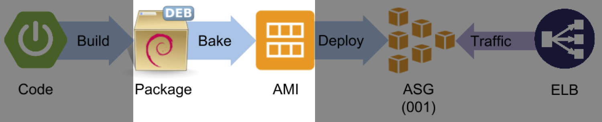

---

---

---
Netflix streaming service started in 2008

---
Oracle outage

---
Migrate to the cloud

---

^ - As we migrated to the cloud, we learned a lot of lessons

---

^ - we learned a lot of lessons
- these lessons have been codified in our OSS
- we began open sourcing in _____

---

^ - 128 repos in Netflix org

---
# [fit] _Build_ and _deploy_ to the cloud using

### Mike McGarr   _*[@SonOfGarr](http://twitter.com/SonOfGarr)*_   _*[MikeMcGarr.com](http://www.mikemcgarr.com)*_

^ I will start with an example

---
- create an *installable* Java microservice
- standup a Netflix OSS AWS *infrastructure*
- package and deploy to cloud

---

---

---
# A simple microservice

- Java 8 (GROOVY?)
- Spring Boot

---

---

---

---

let's run a build

---

*Gradle's Application Plugin*
gives us a runnable app

---

^ - go back to our pipeline
- need to convert code to Debian

---
Immutable server pattern

^ - never change code running on an instance
- prevent configuration drift
- easily scale up and scale down

---

^ should I remove this slide?

---

## Nebula Plugins

dependency lock *plugin*
resolution rules *plugin*
dependency recommender *plugin*
lint *plugin*
metrics *plugin*
test *plugin*
publishing *plugin*
ospackage *plugin*

---

1. Add the *Nebula ospackage* plugin (blue)
2. Define the *Debian* package content (red)

---

---

let's build a *Debian* package

---

*Nebula's* ospackage plugin
produces a *Debian* package

---

---
unit of deployment

---
# Baking

---

---

Aminator

---

---
`sudo aminate /
-e ec2_aptitude_linux /
-b ubuntu-base-ami-ebs /
helloworld_1.0.0_all.deb`

---

---
# AWS (to cover)
- Auto scaling group concept
- map an AMI to an ASG
- ASG's contain homogenous instances
- new deployments create new ASG's
- ASG's are essentially versioned
- How do you group ASG's to an application?

---

---
What's missing
- commit to build to bake to deploy
-

---
# Deployment infrastructure

- GitHub
- Jenkins
- Spinnaker

---
Continuous delivery

---
